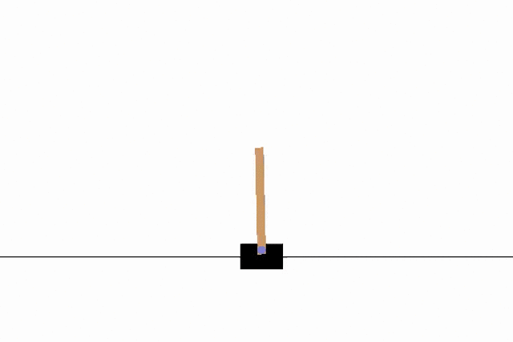
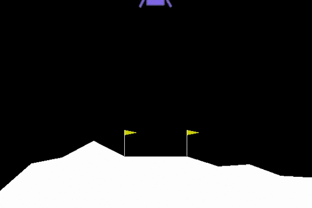
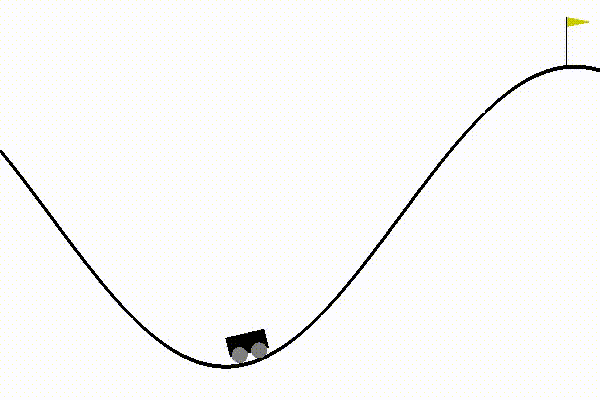

# Reinforcement Learning - OpenAI gym
This repository contains the solutions for the OpenAI gym environments using different Deep Reinforcement Learning algorithms.  
**Objective:** For the default OpenAI Gym environments, their goals are to achieve a certain average threshold reward value for a consecutive number of trials (eposides) as available [here](https://github.com/openai/gym/wiki/Table-of-environments). For the environments other than that provided by the OpenAI Gym, their goal reward is set to `0` and number of trials to `1` by default. 

|    |    |  
| ------------- | ------------- |  
|   |   |  
|   |   |


## Conda installation
1. Install [Conda](https://docs.anaconda.com/anaconda/install/linux/)
2. Clone this repository (let's say to ${SRC_DIR})
3. Create and activate conda environment with following command  
```shell
cd ${SRC_DIR}  
conda env create -f environment.yml    
conda activate open_ai_gym
```

## Supported RL environments
- [OpenAI gym](https://gym.openai.com/envs)
  - Classic control
  - Box2D (except `CarRacing-v0` which consumes all memory as its state space consists of 96x96 RGB images)
  - Mujoco (needs activation as described [here](https://github.com/openai/mujoco-py))
  - Robotics
- [PyBullet](https://pybullet.org/wordpress/)
- [Highway-env](https://github.com/eleurent/highway-env) 

## Implemented RL algorithms
Following model-free Deep RL algorithms are available:  

| Off-Policy | On-Policy |  
| ------------- | ------------- |  
| DQN  | SARSA |  
| DDQN | REINFORCE|  
| DDPG | A2C |  
| SAC  |   |  


## Usage:
## Training the agent
- Create a YAML config file (let's say `sarsa_cartpole.yaml`) 
```YAML
CartPole-v1:
  env_name: CartPole-v1
  epochs: 1000
  render: False
  record_interval: 10
  summary_dir: summaries/classic_control
  algo:
    name: sarsa
    kwargs:
      clip_norm: 5.0
      num_gradient_steps: 2
      gamma_kwargs:
        type: ConstantScheduler
        value: 0.9
      lr_kwargs:
        type: ConstantScheduler
        value: 0.0003
  policy:
    name: greedy_epsilon
    kwargs:
      eps_kwargs:
        type: ExpScheduler      # y = exp(-decay_rate*t) where t = epoch
        decay_rate: 0.01
        update_step: 20
        clip_range: [0.001, 0.6]
```
[comment]: <> (Organise attributes and their descritions in a table)
- The valid parameters for the YAML config file are as follows:
    * `env_name`: (str) Name of the [OpenAI gym](https://github.com/openai/gym/wiki/Table-of-environments) / [PyBullet](https://docs.google.com/document/d/10sXEhzFRSnvFcl3XxNGhnD4N2SedqwdAvK3dsihxVUA/edit#) environment
    * `epochs`:  (int) Number of training epochs. Defaults to **1000**.
    * `render`: (bool) When set to **True**, renders each epoch on the display. Defaults to **False**.
    * `record_interval` : (int) Interval (in terms of epoch) to record and save the given epoch as mp4 video. Defaults to **10**. 
      > For some envrionments, recording videos also renders the recorded epochs.
    * `load_model`: (str) To resume a training, assign a path to the directory with a pretrained model saved as a checkpoint. Defaults to **None**.
    * `include`: (list[str]) List of additional Gym environment modules  required to be imported to load an environment. For instance, for the PyBullet environments, `include` = `[pybullet_envs]` will import `pybullet_envs` before loading the environment. Defaults to `None`. 
    * `algo`:
      * `name`: (str) Name of one of the supported algorithms from [here](/src/Algorithm) in *snake_case* naming convention.
      * `kwargs` : (dict) Arguments of the given algorithm as key-value pairs. Supported arguments for each algorithm can be found [here](src/config.py).  
    * `policy`:
      * `name`: (str) Name of one of the supported policies from [here](/src/Policy) in *snake_case* naming convention.
      * `kwargs`: (dict) Arguments of the given policy as key-value pairs. Supported arguments for each policy can be found [here](src/config.py).
- Enter the following command:  
```shell
python train.py sarsa_cartpole.yaml
```
The above command will train the agent on the `CartPole-v1` environments using the `SARSA` algorithm with `Greedy Epsilon` policy.

***
## Summary information
- Track the summary in real-time with tensorboard using the command.  
```shell
tensorboard --host localhost --logdir ${summary_dir}
```
The respective summary directory contains following files and directories:
- **model**: tensorboard summary and the best trained model (as checkpoints).
- **videos**: recorded videos if `--record_interval` argument was passed while training or testing the model
- **policy.tf**: best trained policy model
- **goal_info.yaml**: YAML file with given goal information: number of goals achieved, epoch and reward values for the first goal and max reward.
- **config.yaml**: YAML file with parameters used to train the given model.

***
## Testing the agent
To test the agent previously trained on the `CartPole-v1` using the `SARSA` algorithm, enter the following command:
```shell
python test.py --env_name CartPole-v1 --load_model ${path/to/policy.tf} --epochs 10
```
Here the `${path/to/policy.tf}` is the path to the `policy.tf` model located in the summary directory of the previous experiment.